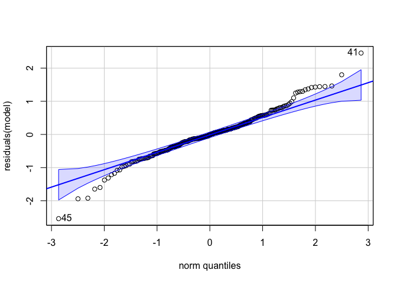

PolyIC resazurin testing
================
AS Huffmyer
2024

This script analyzes tests and trials of resazurin assays for the PolyIC
seed project.

From this testing we need to try a few things:

1.  Run the assays for a longer period of time (6 h)
2.  Run the assay at a lower temperature to maintain \>50% mortality by
    the end of the 4 hour period at least with less at the 24 hour time
    point

# Set up

Set up workspace, set options, and load required packages.

``` r
knitr::opts_chunk$set(echo = TRUE, warning = FALSE, message = FALSE)
```

Load libraries.

``` r
library(MASS) 
library(tidyverse)
library(ggplot2)
library(readxl)
library(cowplot)
library(lme4)
library(lmerTest)
library(car)
library(effects)
library(emmeans)
```

# Volume testing

We first tested the signal intensity using 100, 200, or 300 µL resazurin
working stock.

## Load data

``` r
# Set the folder path
folder_path <- "data/resazurin/plate_files/volume-testing/"  # Replace with your folder path

# List all Excel files in the folder
file_list <- list.files(path = folder_path, pattern = "\\.xls$", full.names = TRUE)

# Check if any files are found
if (length(file_list) == 0) {
  stop("No Excel files found in the specified folder. Check the folder path or file extension.")
}

# Initialize an empty list to store data frames
data_list <- list()

# Loop through each file and load the data
for (file in file_list) {
  # Ensure file is a character string
  if (!is.character(file)) next
  
  # Extract file name without extension
  file_name <- tools::file_path_sans_ext(basename(file))
  
  # Read the Excel file
  data <- read_excel(file)
  
  # Add a new column with the file name
  data <- data %>%
    mutate(FileName = file_name) %>%
    # Extract plate, date, temperature, and timepoint
    mutate(
      plate = str_extract(FileName, "plate\\d+"),             # Extract "plateX"
      date = str_extract(FileName, "^\\d{8}"),               # Extract 8-digit date
      temperature = str_extract(FileName, "control|high"),   # Extract "control" or "test"
      timepoint = str_extract(FileName, "T\\d+") %>%         # Extract "T0", "T1", etc.
        str_remove("T") %>%                                  # Remove "T" prefix
        as.numeric()                                         # Convert to numeric
    )
  
  # Store the data frame in the list
  data_list[[file_name]] <- data
}

# Combine all data frames into a single data frame (optional)
combined_data <- bind_rows(data_list, .id = "Source")

# Print the first few rows of the combined data (optional)
head(combined_data)
```

    ## # A tibble: 6 × 12
    ##   Source  Plate Repeat Well  Type     Time Resazurin 0.1 (Count…¹ FileName plate
    ##   <chr>   <dbl>  <dbl> <chr> <chr>   <dbl>                  <dbl> <chr>    <chr>
    ## 1 202501…     1      1 A01   M     2.25e-4                  19534 2025011… plat…
    ## 2 202501…     1      1 A02   M     2.30e-4                  47665 2025011… plat…
    ## 3 202501…     1      1 A03   M     2.34e-4                  43557 2025011… plat…
    ## 4 202501…     1      1 A04   M     2.38e-4                  58812 2025011… plat…
    ## 5 202501…     1      1 A05   M     2.42e-4                  37008 2025011… plat…
    ## 6 202501…     1      1 A06   M     2.47e-4                  34483 2025011… plat…
    ## # ℹ abbreviated name: ¹​`Resazurin 0.1 (Counts)`
    ## # ℹ 3 more variables: date <chr>, temperature <chr>, timepoint <dbl>

``` r
# Rename columns
combined_data<-combined_data%>%
  select(!c(Repeat, Type, Time, Source, Plate))%>%
  rename("well"=Well, resazurin_counts=`Resazurin 0.1 (Counts)`)%>%
  mutate(timepoint=as.character(timepoint))

head(combined_data)
```

    ## # A tibble: 6 × 7
    ##   well  resazurin_counts FileName              plate date  temperature timepoint
    ##   <chr>            <dbl> <chr>                 <chr> <chr> <chr>       <chr>    
    ## 1 A01              19534 20250114_control_vol… plat… 2025… control     0        
    ## 2 A02              47665 20250114_control_vol… plat… 2025… control     0        
    ## 3 A03              43557 20250114_control_vol… plat… 2025… control     0        
    ## 4 A04              58812 20250114_control_vol… plat… 2025… control     0        
    ## 5 A05              37008 20250114_control_vol… plat… 2025… control     0        
    ## 6 A06              34483 20250114_control_vol… plat… 2025… control     0

Load in metadata.

``` r
metadata<-read_xlsx(path="data/resazurin/metadata/volume_testing_metadata.xlsx")%>%
  mutate(date=as.character(date))
```

Join with data frame and remove any wells that did not have samples.

``` r
str(combined_data)
```

    ## tibble [960 × 7] (S3: tbl_df/tbl/data.frame)
    ##  $ well            : chr [1:960] "A01" "A02" "A03" "A04" ...
    ##  $ resazurin_counts: num [1:960] 19534 47665 43557 58812 37008 ...
    ##  $ FileName        : chr [1:960] "20250114_control_volumetest_plate1_T0" "20250114_control_volumetest_plate1_T0" "20250114_control_volumetest_plate1_T0" "20250114_control_volumetest_plate1_T0" ...
    ##  $ plate           : chr [1:960] "plate1" "plate1" "plate1" "plate1" ...
    ##  $ date            : chr [1:960] "20250114" "20250114" "20250114" "20250114" ...
    ##  $ temperature     : chr [1:960] "control" "control" "control" "control" ...
    ##  $ timepoint       : chr [1:960] "0" "0" "0" "0" ...

``` r
str(metadata)
```

    ## tibble [72 × 7] (S3: tbl_df/tbl/data.frame)
    ##  $ date          : chr [1:72] "20250114" "20250114" "20250114" "20250114" ...
    ##  $ plate         : chr [1:72] "plate1" "plate1" "plate1" "plate1" ...
    ##  $ temperature   : chr [1:72] "control" "control" "control" "control" ...
    ##  $ spat_treatment: chr [1:72] "control" "control" "control" "control" ...
    ##  $ well          : chr [1:72] "A01" "A02" "A03" "A04" ...
    ##  $ type          : chr [1:72] "sample" "sample" "sample" "sample" ...
    ##  $ volume        : chr [1:72] "100uL" "100uL" "100uL" "100uL" ...

``` r
full_data<-left_join(combined_data, metadata, by=c("date", "plate", "well", "temperature"))%>%
  filter(!is.na(type))

head(full_data)
```

    ## # A tibble: 6 × 10
    ##   well  resazurin_counts FileName              plate date  temperature timepoint
    ##   <chr>            <dbl> <chr>                 <chr> <chr> <chr>       <chr>    
    ## 1 A01              19534 20250114_control_vol… plat… 2025… control     0        
    ## 2 A02              47665 20250114_control_vol… plat… 2025… control     0        
    ## 3 A03              43557 20250114_control_vol… plat… 2025… control     0        
    ## 4 A04              58812 20250114_control_vol… plat… 2025… control     0        
    ## 5 A05              37008 20250114_control_vol… plat… 2025… control     0        
    ## 6 A06              34483 20250114_control_vol… plat… 2025… control     0        
    ## # ℹ 3 more variables: spat_treatment <chr>, type <chr>, volume <chr>

## Prep the data

Plot the data.

``` r
full_data%>%
  ggplot(aes(x=timepoint, y=resazurin_counts, colour=temperature, group=interaction(date, plate, well)))+
  facet_wrap(~volume)+
  geom_point()+
  geom_line()+
  scale_colour_manual(values=c("cyan4", "orange"))+
  theme_classic()
```

<!-- -->

Calculate fluorescence at each time point normalized to the starting
value at time 0.

``` r
full_data<-full_data%>%
  group_by(date, plate, well, temperature, spat_treatment)%>%
  arrange(date, plate, well)%>%
  mutate(fluorescence.norm=resazurin_counts/first(resazurin_counts))
```

Plot again.

``` r
full_data%>%
  ggplot(aes(x=timepoint, y=fluorescence.norm, colour=temperature, group=interaction(date, plate, well)))+
  facet_wrap(~volume)+
  geom_point()+
  geom_line()+
  scale_colour_manual(values=c("cyan4", "orange"))+
  theme_classic()
```

<!-- -->

View blanks

``` r
full_data%>%
  filter(type=="blank")%>%
  ggplot(aes(x=timepoint, y=fluorescence.norm, colour=temperature, group=interaction(date, plate, well)))+
  facet_wrap(~volume)+
  geom_point()+
  scale_colour_manual(values=c("cyan4", "orange"))+
  geom_line()+
  theme_classic()
```

<!-- -->

There is more of a change in the fluorescence values at high
temperature.

Calculate mean change in blank at each time point.

``` r
blanks<-full_data%>%
  filter(type=="blank")%>%
  group_by(date, plate, temperature, timepoint, volume)%>%
  summarise(mean_blank=mean(fluorescence.norm));blanks
```

    ## # A tibble: 30 × 6
    ## # Groups:   date, plate, temperature, timepoint [10]
    ##    date     plate  temperature timepoint volume mean_blank
    ##    <chr>    <chr>  <chr>       <chr>     <chr>       <dbl>
    ##  1 20250114 plate1 control     0         100uL       1    
    ##  2 20250114 plate1 control     0         200uL       1    
    ##  3 20250114 plate1 control     0         300uL       1    
    ##  4 20250114 plate1 control     1         100uL       0.988
    ##  5 20250114 plate1 control     1         200uL       1.01 
    ##  6 20250114 plate1 control     1         300uL       1.02 
    ##  7 20250114 plate1 control     2         100uL       1.01 
    ##  8 20250114 plate1 control     2         200uL       1.03 
    ##  9 20250114 plate1 control     2         300uL       1.02 
    ## 10 20250114 plate1 control     3         100uL       1.01 
    ## # ℹ 20 more rows

View summarized blank data.

``` r
blanks%>%
  ggplot(aes(x=timepoint, y=mean_blank, colour=temperature))+
  facet_wrap(~volume)+
  geom_point()+
  scale_colour_manual(values=c("cyan4", "orange"))+
  geom_line()+
  theme_classic()
```

<!-- -->

Subtract blank values from fluorescence values for oysters.

``` r
full_data<-left_join(full_data, blanks)

full_data<-full_data%>%
  filter(!type=="blank")%>%
  mutate(value=fluorescence.norm-mean_blank)
```

Plot again.

``` r
full_data%>%
  ggplot(aes(x=timepoint, y=value, colour=temperature, group=interaction(date, plate, well)))+
  facet_wrap(~volume)+
  geom_point()+
  geom_line()+
  scale_colour_manual(values=c("cyan4", "orange"))+
  theme_classic()
```

<!-- -->

Remove unnecessary columns.

``` r
full_data<-full_data%>%
  select(!resazurin_counts)%>%
  select(!FileName)%>%
  select(!type)%>%
  select(!fluorescence.norm)%>%
  select(!mean_blank)
```

We will not be doing size normalization for this test.

## Analyze

### Modeling

Plot raw data.

``` r
full_data%>%
  ggplot(aes(x=timepoint, y=value, colour=temperature, group=interaction(date, plate, well)))+
  facet_wrap(~volume)+
  geom_point()+
  scale_colour_manual(values=c("cyan4", "orange"))+
  geom_line()+
  theme_classic()
```

<!-- -->

``` r
full_data%>%
  ggplot(aes(x=timepoint, y=value, colour=volume, group=interaction(date, plate, well)))+
  facet_wrap(~temperature)+
  geom_point()+
  geom_line()+
  theme_classic()
```

<!-- -->

``` r
model<-lmer(value ~ timepoint * temperature * volume + (1|plate:well), data=full_data)

summary(model)
```

    ## Linear mixed model fit by REML. t-tests use Satterthwaite's method [
    ## lmerModLmerTest]
    ## Formula: value ~ timepoint * temperature * volume + (1 | plate:well)
    ##    Data: full_data
    ## 
    ## REML criterion at convergence: 630.4
    ## 
    ## Scaled residuals: 
    ##     Min      1Q  Median      3Q     Max 
    ## -3.3170 -0.4791 -0.0131  0.4460  3.2073 
    ## 
    ## Random effects:
    ##  Groups     Name        Variance Std.Dev.
    ##  plate:well (Intercept) 0.7579   0.8706  
    ##  Residual               0.5856   0.7652  
    ## Number of obs: 240, groups:  plate:well, 48
    ## 
    ## Fixed effects:
    ##                                          Estimate Std. Error         df t value
    ## (Intercept)                             8.024e-14  4.098e-01  9.239e+01   0.000
    ## timepoint1                              1.364e+00  3.826e-01  1.680e+02   3.566
    ## timepoint2                              1.737e+00  3.826e-01  1.680e+02   4.539
    ## timepoint3                              2.143e+00  3.826e-01  1.680e+02   5.602
    ## timepoint4                              2.521e+00  3.826e-01  1.680e+02   6.589
    ## temperaturehigh                        -5.845e-14  5.795e-01  9.239e+01   0.000
    ## volume200uL                            -7.704e-14  5.795e-01  9.239e+01   0.000
    ## volume300uL                            -7.535e-14  5.795e-01  9.239e+01   0.000
    ## timepoint1:temperaturehigh             -2.492e-01  5.411e-01  1.680e+02  -0.461
    ## timepoint2:temperaturehigh             -4.519e-01  5.411e-01  1.680e+02  -0.835
    ## timepoint3:temperaturehigh             -3.163e-01  5.411e-01  1.680e+02  -0.585
    ## timepoint4:temperaturehigh             -6.454e-02  5.411e-01  1.680e+02  -0.119
    ## timepoint1:volume200uL                  3.617e-01  5.411e-01  1.680e+02   0.668
    ## timepoint2:volume200uL                  2.161e+00  5.411e-01  1.680e+02   3.994
    ## timepoint3:volume200uL                  2.623e+00  5.411e-01  1.680e+02   4.847
    ## timepoint4:volume200uL                  2.801e+00  5.411e-01  1.680e+02   5.177
    ## timepoint1:volume300uL                 -8.746e-01  5.411e-01  1.680e+02  -1.616
    ## timepoint2:volume300uL                 -6.751e-01  5.411e-01  1.680e+02  -1.248
    ## timepoint3:volume300uL                 -2.772e-01  5.411e-01  1.680e+02  -0.512
    ## timepoint4:volume300uL                  2.164e-01  5.411e-01  1.680e+02   0.400
    ## temperaturehigh:volume200uL             5.290e-14  8.196e-01  9.239e+01   0.000
    ## temperaturehigh:volume300uL             5.393e-14  8.196e-01  9.239e+01   0.000
    ## timepoint1:temperaturehigh:volume200uL -7.252e-01  7.652e-01  1.680e+02  -0.948
    ## timepoint2:temperaturehigh:volume200uL -2.601e+00  7.652e-01  1.680e+02  -3.399
    ## timepoint3:temperaturehigh:volume200uL -3.223e+00  7.652e-01  1.680e+02  -4.212
    ## timepoint4:temperaturehigh:volume200uL -3.810e+00  7.652e-01  1.680e+02  -4.979
    ## timepoint1:temperaturehigh:volume300uL  7.318e-02  7.652e-01  1.680e+02   0.096
    ## timepoint2:temperaturehigh:volume300uL -1.975e-01  7.652e-01  1.680e+02  -0.258
    ## timepoint3:temperaturehigh:volume300uL -9.092e-01  7.652e-01  1.680e+02  -1.188
    ## timepoint4:temperaturehigh:volume300uL -1.657e+00  7.652e-01  1.680e+02  -2.165
    ##                                        Pr(>|t|)    
    ## (Intercept)                            1.000000    
    ## timepoint1                             0.000472 ***
    ## timepoint2                             1.07e-05 ***
    ## timepoint3                             8.49e-08 ***
    ## timepoint4                             5.47e-10 ***
    ## temperaturehigh                        1.000000    
    ## volume200uL                            1.000000    
    ## volume300uL                            1.000000    
    ## timepoint1:temperaturehigh             0.645725    
    ## timepoint2:temperaturehigh             0.404807    
    ## timepoint3:temperaturehigh             0.559665    
    ## timepoint4:temperaturehigh             0.905203    
    ## timepoint1:volume200uL                 0.504799    
    ## timepoint2:volume200uL                 9.68e-05 ***
    ## timepoint3:volume200uL                 2.83e-06 ***
    ## timepoint4:volume200uL                 6.38e-07 ***
    ## timepoint1:volume300uL                 0.107904    
    ## timepoint2:volume300uL                 0.213890    
    ## timepoint3:volume300uL                 0.609162    
    ## timepoint4:volume300uL                 0.689746    
    ## temperaturehigh:volume200uL            1.000000    
    ## temperaturehigh:volume300uL            1.000000    
    ## timepoint1:temperaturehigh:volume200uL 0.344658    
    ## timepoint2:temperaturehigh:volume200uL 0.000846 ***
    ## timepoint3:temperaturehigh:volume200uL 4.12e-05 ***
    ## timepoint4:temperaturehigh:volume200uL 1.57e-06 ***
    ## timepoint1:temperaturehigh:volume300uL 0.923930    
    ## timepoint2:temperaturehigh:volume300uL 0.796657    
    ## timepoint3:temperaturehigh:volume300uL 0.236423    
    ## timepoint4:temperaturehigh:volume300uL 0.031779 *  
    ## ---
    ## Signif. codes:  0 '***' 0.001 '**' 0.01 '*' 0.05 '.' 0.1 ' ' 1

``` r
anova(model)
```

    ## Type III Analysis of Variance Table with Satterthwaite's method
    ##                               Sum Sq Mean Sq NumDF DenDF F value    Pr(>F)    
    ## timepoint                    193.373  48.343     4   168 82.5596 < 2.2e-16 ***
    ## temperature                    9.477   9.477     1    42 16.1851 0.0002344 ***
    ## volume                         7.017   3.508     2    42  5.9914 0.0051389 ** 
    ## timepoint:temperature         31.956   7.989     4   168 13.6434 1.182e-09 ***
    ## timepoint:volume              19.383   2.423     8   168  4.1378 0.0001560 ***
    ## temperature:volume             6.187   3.094     2    42  5.2833 0.0089814 ** 
    ## timepoint:temperature:volume  23.390   2.924     8   168  4.9931 1.445e-05 ***
    ## ---
    ## Signif. codes:  0 '***' 0.001 '**' 0.01 '*' 0.05 '.' 0.1 ' ' 1

``` r
rand(model)
```

    ## ANOVA-like table for random-effects: Single term deletions
    ## 
    ## Model:
    ## value ~ timepoint + temperature + volume + (1 | plate:well) + timepoint:temperature + timepoint:volume + temperature:volume + timepoint:temperature:volume
    ##                  npar  logLik    AIC    LRT Df Pr(>Chisq)    
    ## <none>             32 -315.21 694.41                         
    ## (1 | plate:well)   31 -360.17 782.33 89.923  1  < 2.2e-16 ***
    ## ---
    ## Signif. codes:  0 '***' 0.001 '**' 0.01 '*' 0.05 '.' 0.1 ' ' 1

``` r
qqPlot(residuals(model))
```

<!-- -->

    ## [1] 45 41

Plot with individual points with geom smooth lines.

``` r
plot1<-full_data%>%

  ggplot(aes(x=timepoint, y=value, color=temperature, fill=temperature))+
  facet_grid(~volume)+
  geom_point(alpha=0.5)+
  geom_smooth(aes(group=temperature))+
  scale_colour_manual(values=c("cyan4", "orange"))+
  scale_fill_manual(values=c("cyan4", "orange"))+
  theme_classic()+
  xlab("Hour");plot1
```

<!-- -->

``` r
plot1a<-full_data%>%

  ggplot(aes(x=timepoint, y=value, color=volume, fill=volume))+
  facet_grid(~temperature)+
  geom_point(alpha=0.5)+
  geom_smooth(aes(group=volume))+
  theme_classic()+
  xlab("Hour");plot1a
```

<!-- -->

# Temperature testing

Today I tested the assay at 36°C due to high mortality at 42°C.

## Load data

``` r
# Set the folder path
folder_path <- "data/resazurin/plate_files/temperature-testing/"  # Replace with your folder path

# List all Excel files in the folder
file_list <- list.files(path = folder_path, pattern = "\\.xls$", full.names = TRUE)

# Check if any files are found
if (length(file_list) == 0) {
  stop("No Excel files found in the specified folder. Check the folder path or file extension.")
}

# Initialize an empty list to store data frames
data_list <- list()

# Loop through each file and load the data
for (file in file_list) {
  # Ensure file is a character string
  if (!is.character(file)) next
  
  # Extract file name without extension
  file_name <- tools::file_path_sans_ext(basename(file))
  
  # Read the Excel file
  data <- read_excel(file)
  
  # Add a new column with the file name
  data <- data %>%
    mutate(FileName = file_name) %>%
    # Extract plate, date, temperature, and timepoint
    mutate(
      plate = str_extract(FileName, "plate\\d+"),             # Extract "plateX"
      date = str_extract(FileName, "^\\d{8}"),               # Extract 8-digit date
      temperature = str_extract(FileName, "control|high"),   # Extract "control" or "test"
      timepoint = str_extract(FileName, "T\\d+") %>%         # Extract "T0", "T1", etc.
        str_remove("T") %>%                                  # Remove "T" prefix
        as.numeric()                                         # Convert to numeric
    )
  
  # Store the data frame in the list
  data_list[[file_name]] <- data
}

# Combine all data frames into a single data frame (optional)
combined_data <- bind_rows(data_list, .id = "Source")

# Print the first few rows of the combined data (optional)
head(combined_data)
```

    ## # A tibble: 6 × 12
    ##   Source  Plate Repeat Well  Type     Time Resazurin 0.1 (Count…¹ FileName plate
    ##   <chr>   <dbl>  <dbl> <chr> <chr>   <dbl>                  <dbl> <chr>    <chr>
    ## 1 202501…     1      1 A01   M     2.25e-4                  23933 2025011… plat…
    ## 2 202501…     1      1 A02   M     2.29e-4                  28004 2025011… plat…
    ## 3 202501…     1      1 A03   M     2.34e-4                  21389 2025011… plat…
    ## 4 202501…     1      1 A04   M     2.38e-4                  20732 2025011… plat…
    ## 5 202501…     1      1 A05   M     2.42e-4                  15278 2025011… plat…
    ## 6 202501…     1      1 A06   M     2.46e-4                  20636 2025011… plat…
    ## # ℹ abbreviated name: ¹​`Resazurin 0.1 (Counts)`
    ## # ℹ 3 more variables: date <chr>, temperature <chr>, timepoint <dbl>

``` r
# Rename columns
combined_data<-combined_data%>%
  select(!c(Repeat, Type, Time, Source, Plate))%>%
  rename("well"=Well, resazurin_counts=`Resazurin 0.1 (Counts)`)%>%
  mutate(timepoint=as.character(timepoint))

head(combined_data)
```

    ## # A tibble: 6 × 7
    ##   well  resazurin_counts FileName              plate date  temperature timepoint
    ##   <chr>            <dbl> <chr>                 <chr> <chr> <chr>       <chr>    
    ## 1 A01              23933 20250115_control_tem… plat… 2025… control     0        
    ## 2 A02              28004 20250115_control_tem… plat… 2025… control     0        
    ## 3 A03              21389 20250115_control_tem… plat… 2025… control     0        
    ## 4 A04              20732 20250115_control_tem… plat… 2025… control     0        
    ## 5 A05              15278 20250115_control_tem… plat… 2025… control     0        
    ## 6 A06              20636 20250115_control_tem… plat… 2025… control     0

Load in metadata.

``` r
metadata<-read_xlsx(path="data/resazurin/metadata/temperature_testing_metadata.xlsx")%>%
  mutate(date=as.character(date))
```

Join with data frame and remove any wells that did not have samples.

``` r
str(combined_data)
```

    ## tibble [1,152 × 7] (S3: tbl_df/tbl/data.frame)
    ##  $ well            : chr [1:1152] "A01" "A02" "A03" "A04" ...
    ##  $ resazurin_counts: num [1:1152] 23933 28004 21389 20732 15278 ...
    ##  $ FileName        : chr [1:1152] "20250115_control_temptest_plate1_T0" "20250115_control_temptest_plate1_T0" "20250115_control_temptest_plate1_T0" "20250115_control_temptest_plate1_T0" ...
    ##  $ plate           : chr [1:1152] "plate1" "plate1" "plate1" "plate1" ...
    ##  $ date            : chr [1:1152] "20250115" "20250115" "20250115" "20250115" ...
    ##  $ temperature     : chr [1:1152] "control" "control" "control" "control" ...
    ##  $ timepoint       : chr [1:1152] "0" "0" "0" "0" ...

``` r
str(metadata)
```

    ## tibble [60 × 6] (S3: tbl_df/tbl/data.frame)
    ##  $ date          : chr [1:60] "20250115" "20250115" "20250115" "20250115" ...
    ##  $ plate         : chr [1:60] "plate1" "plate1" "plate1" "plate1" ...
    ##  $ temperature   : chr [1:60] "control" "control" "control" "control" ...
    ##  $ spat_treatment: chr [1:60] "control" "control" "control" "control" ...
    ##  $ well          : chr [1:60] "A01" "A02" "A03" "A04" ...
    ##  $ type          : chr [1:60] "sample" "sample" "sample" "sample" ...

``` r
full_data<-left_join(combined_data, metadata, by=c("date", "plate", "well", "temperature"))%>%
  filter(!is.na(type))

head(full_data)
```

    ## # A tibble: 6 × 9
    ##   well  resazurin_counts FileName              plate date  temperature timepoint
    ##   <chr>            <dbl> <chr>                 <chr> <chr> <chr>       <chr>    
    ## 1 A01              23933 20250115_control_tem… plat… 2025… control     0        
    ## 2 A02              28004 20250115_control_tem… plat… 2025… control     0        
    ## 3 A03              21389 20250115_control_tem… plat… 2025… control     0        
    ## 4 A04              20732 20250115_control_tem… plat… 2025… control     0        
    ## 5 A05              15278 20250115_control_tem… plat… 2025… control     0        
    ## 6 A06              20636 20250115_control_tem… plat… 2025… control     0        
    ## # ℹ 2 more variables: spat_treatment <chr>, type <chr>

## Prep the data

Plot the data.

``` r
full_data%>%
  ggplot(aes(x=timepoint, y=resazurin_counts, colour=temperature, group=interaction(date, plate, well)))+
  facet_wrap(~spat_treatment)+
  geom_point()+
  geom_line()+
  scale_colour_manual(values=c("cyan4", "orange"))+
  theme_classic()
```

<!-- -->

Calculate fluorescence at each time point normalized to the starting
value at time 0.

``` r
full_data<-full_data%>%
  group_by(date, plate, well, temperature, spat_treatment)%>%
  arrange(date, plate, well)%>%
  mutate(fluorescence.norm=resazurin_counts/first(resazurin_counts))
```

Plot again.

``` r
full_data%>%
  ggplot(aes(x=timepoint, y=fluorescence.norm, colour=temperature, group=interaction(date, plate, well)))+
  facet_wrap(~spat_treatment)+
  geom_point()+
  geom_line()+
  scale_colour_manual(values=c("cyan4", "orange"))+
  theme_classic()
```

<!-- -->

View blanks

``` r
full_data%>%
  filter(type=="blank")%>%
  ggplot(aes(x=timepoint, y=fluorescence.norm, colour=temperature, group=interaction(date, plate, well)))+
  geom_point()+
  scale_colour_manual(values=c("cyan4", "orange"))+
  geom_line()+
  theme_classic()
```

<!-- -->

There is more of a change in the fluorescence values at high
temperature.

Calculate mean change in blank at each time point.

``` r
blanks<-full_data%>%
  filter(type=="blank")%>%
  group_by(date, plate, temperature, timepoint)%>%
  summarise(mean_blank=mean(fluorescence.norm));blanks
```

    ## # A tibble: 12 × 5
    ## # Groups:   date, plate, temperature [2]
    ##    date     plate  temperature timepoint mean_blank
    ##    <chr>    <chr>  <chr>       <chr>          <dbl>
    ##  1 20250115 plate1 control     0               1   
    ##  2 20250115 plate1 control     1               1.09
    ##  3 20250115 plate1 control     2               1.10
    ##  4 20250115 plate1 control     3               1.11
    ##  5 20250115 plate1 control     4               1.12
    ##  6 20250115 plate1 control     5               1.11
    ##  7 20250115 plate2 high        0               1   
    ##  8 20250115 plate2 high        1               1.38
    ##  9 20250115 plate2 high        2               1.58
    ## 10 20250115 plate2 high        3               1.86
    ## 11 20250115 plate2 high        4               1.85
    ## 12 20250115 plate2 high        5               1.91

View summarized blank data.

``` r
blanks%>%
  ggplot(aes(x=timepoint, y=mean_blank, colour=temperature))+
  geom_point()+
  scale_colour_manual(values=c("cyan4", "orange"))+
  geom_line()+
  theme_classic()
```

<!-- -->

Subtract blank values from fluorescence values for oysters.

``` r
full_data<-left_join(full_data, blanks)

full_data<-full_data%>%
  filter(!type=="blank")%>%
  mutate(value=fluorescence.norm-mean_blank)
```

Plot again.

``` r
full_data%>%
  ggplot(aes(x=timepoint, y=value, colour=temperature, group=interaction(date, plate, well)))+
  facet_wrap(~spat_treatment)+
  geom_point()+
  geom_line()+
  scale_colour_manual(values=c("cyan4", "orange"))+
  theme_classic()
```

<!-- -->

Remove unnecessary columns.

``` r
full_data<-full_data%>%
  select(!resazurin_counts)%>%
  select(!FileName)%>%
  select(!type)%>%
  select(!fluorescence.norm)%>%
  select(!mean_blank)
```

We will not be doing size normalization for this test.

## Analyze

### Modeling

Plot raw data.

``` r
full_data%>%
  ggplot(aes(x=timepoint, y=value, colour=temperature, group=interaction(date, plate, well)))+
  facet_wrap(~spat_treatment)+
  geom_point()+
  scale_colour_manual(values=c("cyan4", "orange"))+
  geom_line()+
  theme_classic()
```

<!-- -->

``` r
full_data%>%
  ggplot(aes(x=timepoint, y=value, colour=spat_treatment, group=interaction(date, plate, well)))+
  facet_wrap(~temperature)+
  geom_point()+
  geom_line()+
  theme_classic()
```

<!-- -->

``` r
model<-lmer(value ~ timepoint * temperature * spat_treatment + (1|plate:well), data=full_data)

summary(model)
```

    ## Linear mixed model fit by REML. t-tests use Satterthwaite's method [
    ## lmerModLmerTest]
    ## Formula: value ~ timepoint * temperature * spat_treatment + (1 | plate:well)
    ##    Data: full_data
    ## 
    ## REML criterion at convergence: 1177.4
    ## 
    ## Scaled residuals: 
    ##     Min      1Q  Median      3Q     Max 
    ## -4.1523 -0.4005 -0.0041  0.3503  4.9317 
    ## 
    ## Random effects:
    ##  Groups     Name        Variance Std.Dev.
    ##  plate:well (Intercept) 3.324    1.823   
    ##  Residual               2.858    1.690   
    ## Number of obs: 288, groups:  plate:well, 48
    ## 
    ## Fixed effects:
    ##                                                    Estimate Std. Error
    ## (Intercept)                                       7.363e-14  7.177e-01
    ## timepoint1                                        6.316e-01  6.901e-01
    ## timepoint2                                        8.463e-01  6.901e-01
    ## timepoint3                                        1.507e+00  6.901e-01
    ## timepoint4                                        1.767e+00  6.901e-01
    ## timepoint5                                        2.223e+00  6.901e-01
    ## temperaturehigh                                  -6.209e-14  1.015e+00
    ## spat_treatmenttreated                            -4.287e-14  1.015e+00
    ## timepoint1:temperaturehigh                        3.202e-02  9.760e-01
    ## timepoint2:temperaturehigh                        1.249e-01  9.760e-01
    ## timepoint3:temperaturehigh                       -8.305e-01  9.760e-01
    ## timepoint4:temperaturehigh                        2.787e-01  9.760e-01
    ## timepoint5:temperaturehigh                        1.012e+00  9.760e-01
    ## timepoint1:spat_treatmenttreated                  8.390e-01  9.760e-01
    ## timepoint2:spat_treatmenttreated                  1.125e+00  9.760e-01
    ## timepoint3:spat_treatmenttreated                  1.374e+00  9.760e-01
    ## timepoint4:spat_treatmenttreated                  1.793e+00  9.760e-01
    ## timepoint5:spat_treatmenttreated                  2.608e+00  9.760e-01
    ## temperaturehigh:spat_treatmenttreated             4.169e-14  1.435e+00
    ## timepoint1:temperaturehigh:spat_treatmenttreated -1.887e-01  1.380e+00
    ## timepoint2:temperaturehigh:spat_treatmenttreated  5.630e-01  1.380e+00
    ## timepoint3:temperaturehigh:spat_treatmenttreated  3.894e+00  1.380e+00
    ## timepoint4:temperaturehigh:spat_treatmenttreated  3.850e+00  1.380e+00
    ## timepoint5:temperaturehigh:spat_treatmenttreated  3.994e+00  1.380e+00
    ##                                                          df t value Pr(>|t|)   
    ## (Intercept)                                       1.079e+02   0.000  1.00000   
    ## timepoint1                                        2.200e+02   0.915  0.36107   
    ## timepoint2                                        2.200e+02   1.226  0.22140   
    ## timepoint3                                        2.200e+02   2.184  0.03002 * 
    ## timepoint4                                        2.200e+02   2.560  0.01114 * 
    ## timepoint5                                        2.200e+02   3.221  0.00147 **
    ## temperaturehigh                                   1.079e+02   0.000  1.00000   
    ## spat_treatmenttreated                             1.079e+02   0.000  1.00000   
    ## timepoint1:temperaturehigh                        2.200e+02   0.033  0.97385   
    ## timepoint2:temperaturehigh                        2.200e+02   0.128  0.89830   
    ## timepoint3:temperaturehigh                        2.200e+02  -0.851  0.39571   
    ## timepoint4:temperaturehigh                        2.200e+02   0.286  0.77551   
    ## timepoint5:temperaturehigh                        2.200e+02   1.037  0.30085   
    ## timepoint1:spat_treatmenttreated                  2.200e+02   0.860  0.39094   
    ## timepoint2:spat_treatmenttreated                  2.200e+02   1.153  0.25010   
    ## timepoint3:spat_treatmenttreated                  2.200e+02   1.407  0.16073   
    ## timepoint4:spat_treatmenttreated                  2.200e+02   1.837  0.06754 . 
    ## timepoint5:spat_treatmenttreated                  2.200e+02   2.673  0.00809 **
    ## temperaturehigh:spat_treatmenttreated             1.079e+02   0.000  1.00000   
    ## timepoint1:temperaturehigh:spat_treatmenttreated  2.200e+02  -0.137  0.89135   
    ## timepoint2:temperaturehigh:spat_treatmenttreated  2.200e+02   0.408  0.68376   
    ## timepoint3:temperaturehigh:spat_treatmenttreated  2.200e+02   2.821  0.00522 **
    ## timepoint4:temperaturehigh:spat_treatmenttreated  2.200e+02   2.789  0.00574 **
    ## timepoint5:temperaturehigh:spat_treatmenttreated  2.200e+02   2.894  0.00419 **
    ## ---
    ## Signif. codes:  0 '***' 0.001 '**' 0.01 '*' 0.05 '.' 0.1 ' ' 1

``` r
anova(model)
```

    ## Type III Analysis of Variance Table with Satterthwaite's method
    ##                                      Sum Sq Mean Sq NumDF DenDF F value
    ## timepoint                            825.09 165.019     5   220 57.7478
    ## temperature                           11.16  11.161     1    44  3.9059
    ## spat_treatment                        47.70  47.699     1    44 16.6921
    ## timepoint:temperature                 94.86  18.971     5   220  6.6390
    ## timepoint:spat_treatment             202.49  40.498     5   220 14.1721
    ## temperature:spat_treatment             9.19   9.192     1    44  3.2168
    ## timepoint:temperature:spat_treatment  65.52  13.104     5   220  4.5855
    ##                                         Pr(>F)    
    ## timepoint                            < 2.2e-16 ***
    ## temperature                          0.0544077 .  
    ## spat_treatment                       0.0001832 ***
    ## timepoint:temperature                8.851e-06 ***
    ## timepoint:spat_treatment             5.071e-12 ***
    ## temperature:spat_treatment           0.0797599 .  
    ## timepoint:temperature:spat_treatment 0.0005335 ***
    ## ---
    ## Signif. codes:  0 '***' 0.001 '**' 0.01 '*' 0.05 '.' 0.1 ' ' 1

``` r
rand(model)
```

    ## ANOVA-like table for random-effects: Single term deletions
    ## 
    ## Model:
    ## value ~ timepoint + temperature + spat_treatment + (1 | plate:well) + timepoint:temperature + timepoint:spat_treatment + temperature:spat_treatment + timepoint:temperature:spat_treatment
    ##                  npar  logLik    AIC    LRT Df Pr(>Chisq)    
    ## <none>             26 -588.71 1229.4                         
    ## (1 | plate:well)   25 -644.87 1339.7 112.33  1  < 2.2e-16 ***
    ## ---
    ## Signif. codes:  0 '***' 0.001 '**' 0.01 '*' 0.05 '.' 0.1 ' ' 1

``` r
qqPlot(residuals(model))
```

<!-- -->

    ## [1] 262 259

Post hoc tests

``` r
emm<-emmeans(model, ~spat_treatment|temperature|timepoint)
pairs(emm)
```

    ## temperature = control, timepoint = 0:
    ##  contrast          estimate   SE  df t.ratio p.value
    ##  control - treated    0.000 1.02 108   0.000  1.0000
    ## 
    ## temperature = high, timepoint = 0:
    ##  contrast          estimate   SE  df t.ratio p.value
    ##  control - treated    0.000 1.02 108   0.000  1.0000
    ## 
    ## temperature = control, timepoint = 1:
    ##  contrast          estimate   SE  df t.ratio p.value
    ##  control - treated   -0.839 1.02 108  -0.827  0.4103
    ## 
    ## temperature = high, timepoint = 1:
    ##  contrast          estimate   SE  df t.ratio p.value
    ##  control - treated   -0.650 1.02 108  -0.641  0.5232
    ## 
    ## temperature = control, timepoint = 2:
    ##  contrast          estimate   SE  df t.ratio p.value
    ##  control - treated   -1.125 1.02 108  -1.109  0.2700
    ## 
    ## temperature = high, timepoint = 2:
    ##  contrast          estimate   SE  df t.ratio p.value
    ##  control - treated   -1.688 1.02 108  -1.663  0.0991
    ## 
    ## temperature = control, timepoint = 3:
    ##  contrast          estimate   SE  df t.ratio p.value
    ##  control - treated   -1.374 1.02 108  -1.353  0.1788
    ## 
    ## temperature = high, timepoint = 3:
    ##  contrast          estimate   SE  df t.ratio p.value
    ##  control - treated   -5.267 1.02 108  -5.189  <.0001
    ## 
    ## temperature = control, timepoint = 4:
    ##  contrast          estimate   SE  df t.ratio p.value
    ##  control - treated   -1.793 1.02 108  -1.766  0.0802
    ## 
    ## temperature = high, timepoint = 4:
    ##  contrast          estimate   SE  df t.ratio p.value
    ##  control - treated   -5.643 1.02 108  -5.559  <.0001
    ## 
    ## temperature = control, timepoint = 5:
    ##  contrast          estimate   SE  df t.ratio p.value
    ##  control - treated   -2.608 1.02 108  -2.570  0.0115
    ## 
    ## temperature = high, timepoint = 5:
    ##  contrast          estimate   SE  df t.ratio p.value
    ##  control - treated   -6.603 1.02 108  -6.505  <.0001
    ## 
    ## Degrees-of-freedom method: kenward-roger

At high temperature, control and treated spat are different at 3, 4, and
5 hours. At control temperature, rates were higher in treated spat at
hour 5.

Plot with individual points with geom smooth lines.

``` r
plot1<-full_data%>%

  ggplot(aes(x=timepoint, y=value, color=temperature, fill=temperature))+
  facet_grid(~spat_treatment)+
  geom_point(alpha=0.5)+
  geom_smooth(aes(group=temperature))+
  scale_colour_manual(values=c("cyan4", "orange"))+
  scale_fill_manual(values=c("cyan4", "orange"))+
  theme_classic()+
  xlab("Hour");plot1
```

<!-- -->

``` r
plot1a<-full_data%>%

  ggplot(aes(x=timepoint, y=value, color=spat_treatment, fill=spat_treatment))+
  facet_grid(~temperature)+
  geom_point(alpha=0.5)+
  geom_smooth(aes(group=spat_treatment))+
  theme_classic()+
  xlab("Hour");plot1a
```

<!-- -->

Survival at 5 hours:

- No mortality at control temperature
- 3/12 died in treated spat at 36°C
- 0/12 died in control spat at 36°C
