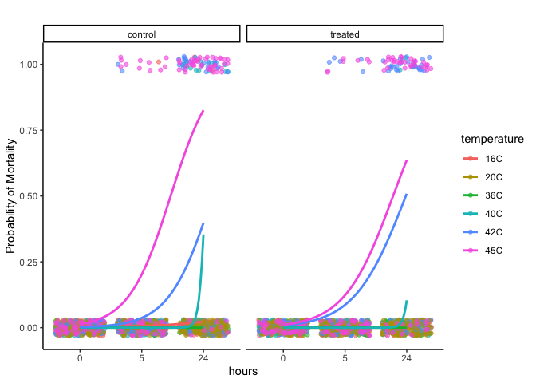
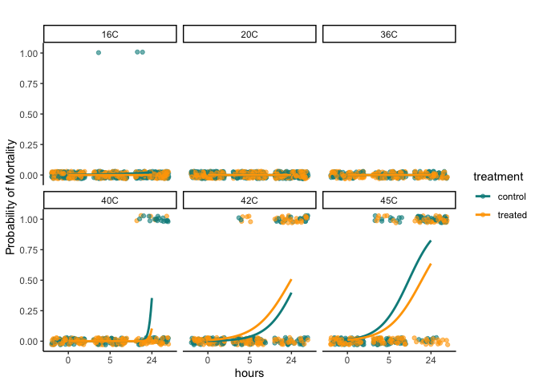
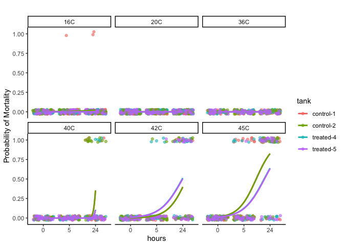
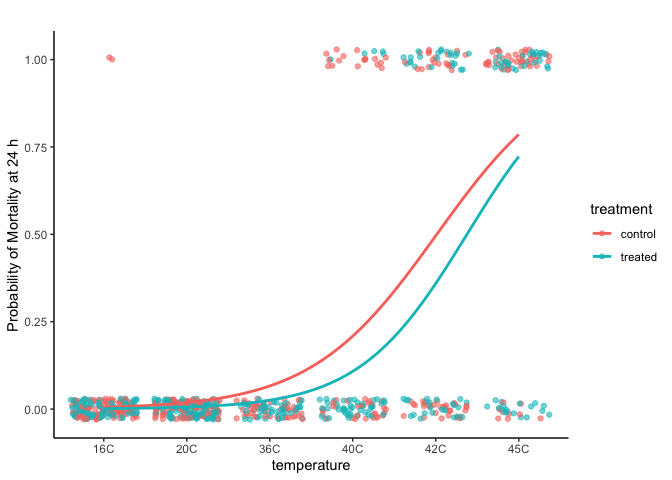

PolyIC survival testing
================
AS Huffmyer
2025

This script analyzes survival assays for the PolyIC seed project.

Before running, click the arrow next to “knit” on the toolbar and select
“project directory”

# Set up

Set up workspace, set options, and load required packages.

``` r
knitr::opts_chunk$set(echo = TRUE, warning = FALSE, message = FALSE)
```

Load libraries.

``` r
library(MASS) 
library(tidyverse)
library(ggplot2)
library(readxl)
library(cowplot)
library(lme4)
library(lmerTest)
library(car)
library(effects)
library(emmeans)
```

# Survival

## Load data

``` r
surv<-read_csv("data/survival/survival_assays.csv")%>%mutate(date=as.character(date))%>%select(!notes)#%>%
 #filter(!date=="20250204")
```

Turn into long format.

``` r
surv<-surv%>%
  pivot_longer(names_to = "hours", values_to = "mortality", cols=c(`0`:`24`))

surv$hours<-factor(surv$hours, levels=c("0", "5", "24"))
```

## Analyze survival

Analyze with binomial logistic regression for effects of temperature and
spat treatment with tank as random effect.

0 = alive 1 = mortality

``` r
surv_model<-glmer(mortality ~ temperature * treatment * hours + (1|tank) + (1|treatment:tank), family = binomial(link = "logit"), data=surv)

summary(surv_model)
```

    ## Generalized linear mixed model fit by maximum likelihood (Laplace
    ##   Approximation) [glmerMod]
    ##  Family: binomial  ( logit )
    ## Formula: mortality ~ temperature * treatment * hours + (1 | tank) + (1 |  
    ##     treatment:tank)
    ##    Data: surv
    ## 
    ##      AIC      BIC   logLik deviance df.resid 
    ##    582.1    800.3   -253.1    506.1     2266 
    ## 
    ## Scaled residuals: 
    ##    Min     1Q Median     3Q    Max 
    ## -2.084  0.000  0.000  0.000  9.746 
    ## 
    ## Random effects:
    ##  Groups         Name        Variance Std.Dev.
    ##  tank           (Intercept) 0.001838 0.04287 
    ##  treatment:tank (Intercept) 0.000735 0.02711 
    ## Number of obs: 2304, groups:  tank, 4; treatment:tank, 4
    ## 
    ## Fixed effects:
    ##                                           Estimate Std. Error z value Pr(>|z|)
    ## (Intercept)                             -2.157e+01  4.930e+03  -0.004    0.997
    ## temperature20C                          -7.012e+01  6.849e+06   0.000    1.000
    ## temperature36C                          -4.803e+01  9.686e+06   0.000    1.000
    ## temperature40C                           4.884e-03  8.525e+03   0.000    1.000
    ## temperature42C                          -1.016e-02  8.567e+03   0.000    1.000
    ## temperature45C                          -4.340e-03  8.551e+03   0.000    1.000
    ## treatmenttreated                         4.839e-02  6.889e+03   0.000    1.000
    ## hours5                                   1.702e+01  4.930e+03   0.003    0.997
    ## hours24                                  1.772e+01  4.930e+03   0.004    0.997
    ## temperature20C:treatmenttreated         -1.878e+01  9.686e+06   0.000    1.000
    ## temperature36C:treatmenttreated          9.501e+00  1.370e+07   0.000    1.000
    ## temperature40C:treatmenttreated          2.131e-02  1.187e+04   0.000    1.000
    ## temperature42C:treatmenttreated          1.109e-02  1.195e+04   0.000    1.000
    ## temperature45C:treatmenttreated         -5.693e-03  1.196e+04   0.000    1.000
    ## temperature20C:hours5                    4.243e+00  9.686e+06   0.000    1.000
    ## temperature36C:hours5                   -1.930e+01  1.370e+07   0.000    1.000
    ## temperature40C:hours5                   -4.550e+01  9.686e+06   0.000    1.000
    ## temperature42C:hours5                    1.429e+00  8.567e+03   0.000    1.000
    ## temperature45C:hours5                    3.346e+00  8.551e+03   0.000    1.000
    ## temperature20C:hours24                  -1.713e+00  9.686e+06   0.000    1.000
    ## temperature36C:hours24                  -2.736e-01  1.370e+07   0.000    1.000
    ## temperature40C:hours24                   3.245e+00  8.525e+03   0.000    1.000
    ## temperature42C:hours24                   3.438e+00  8.567e+03   0.000    1.000
    ## temperature45C:hours24                   5.323e+00  8.551e+03   0.001    1.000
    ## treatmenttreated:hours5                 -1.701e+01  8.393e+03  -0.002    0.998
    ## treatmenttreated:hours24                -1.770e+01  8.373e+03  -0.002    0.998
    ## temperature20C:treatmenttreated:hours5   7.880e+01  1.186e+07   0.000    1.000
    ## temperature36C:treatmenttreated:hours5   5.094e+01  1.678e+07   0.000    1.000
    ## temperature40C:treatmenttreated:hours5   3.138e+01  1.243e+07   0.000    1.000
    ## temperature42C:treatmenttreated:hours5   1.793e+01  1.288e+04   0.001    0.999
    ## temperature45C:treatmenttreated:hours5   1.641e+01  1.289e+04   0.001    0.999
    ## temperature20C:treatmenttreated:hours24 -3.025e+01  1.370e+07   0.000    1.000
    ## temperature36C:treatmenttreated:hours24  3.477e+01  1.678e+07   0.000    1.000
    ## temperature40C:treatmenttreated:hours24  1.608e+01  1.279e+04   0.001    0.999
    ## temperature42C:treatmenttreated:hours24  1.806e+01  1.286e+04   0.001    0.999
    ## temperature45C:treatmenttreated:hours24  1.670e+01  1.287e+04   0.001    0.999
    ## optimizer (Nelder_Mead) convergence code: 4 (failure to converge in 10000 evaluations)
    ## unable to evaluate scaled gradient
    ## Model failed to converge: degenerate  Hessian with 10 negative eigenvalues
    ## failure to converge in 10000 evaluations

``` r
Anova(surv_model)
```

    ## Analysis of Deviance Table (Type II Wald chisquare tests)
    ## 
    ## Response: mortality
    ##                               Chisq Df Pr(>Chisq)    
    ## temperature                 85.9586 10  3.377e-14 ***
    ## treatment                   14.9998  5    0.01036 *  
    ## hours                       76.0035  6  2.385e-14 ***
    ## temperature:treatment       11.7329  6    0.06820 .  
    ## temperature:hours            2.3481 11    0.99685    
    ## treatment:hours              0.6578  3    0.88309    
    ## temperature:treatment:hours  0.0179 10    1.00000    
    ## ---
    ## Signif. codes:  0 '***' 0.001 '**' 0.01 '*' 0.05 '.' 0.1 ' ' 1

Generate predictive mortality.

``` r
# Generate predicted probabilities
surv$predicted_mortality <- predict(surv_model, type = "response")

# Plot
plot2<-ggplot(surv, aes(x = hours, y = predicted_mortality, color = temperature, fill = temperature, group=temperature)) +
  facet_wrap(~treatment)+
  geom_point(aes(y = mortality), alpha = 0.6, position = position_jitter(height = 0.03)) +
  geom_smooth(method = "glm", method.args = list(family = "binomial"), se = FALSE) +
  #scale_colour_manual(values=c("darkgray", "darkred", "blue"))+
  #scale_fill_manual(values=c("darkgray", "darkred", "blue"))+
  labs(
    title = "",
    y = "Probability of Mortality",
  ) +
  theme_classic();plot2
```

<!-- -->

``` r
ggsave(plot2, filename="figures/survival/survival_temperature.png", width=6, height=5)


# Plot
plot2a<-ggplot(surv, aes(x = hours, y = predicted_mortality, color = treatment, fill = treatment, group=treatment)) +
  facet_wrap(~temperature)+
  geom_point(aes(y = mortality), alpha = 0.6, position = position_jitter(height = 0.03)) +
  geom_smooth(method = "glm", method.args = list(family = "binomial"), se = FALSE) +
  scale_colour_manual(values=c("control"="cyan4", "treated"="orange"))+
  scale_fill_manual(values=c("control"="cyan4", "treated"="orange"))+
  labs(
    title = "",
    y = "Probability of Mortality",
  ) +
  theme_classic();plot2a 
```

<!-- -->

``` r
ggsave(plot2a, filename="figures/survival/mortality_temperature.png", width=6, height=5)
```

Plot individual tanks.

``` r
# Plot
plot3<-ggplot(surv, aes(x = hours, y = predicted_mortality, color = tank, fill = tank, group=tank)) +
  facet_wrap(~temperature)+
  geom_point(aes(y = mortality), alpha = 0.6, position = position_jitter(height = 0.03)) +
  geom_smooth(method = "glm", method.args = list(family = "binomial"), se = FALSE) +
  labs(
    title = "",
    y = "Probability of Mortality",
  ) +
  theme_classic();plot3
```

<!-- -->

``` r
# Plot
plot4<-surv%>%
  filter(hours=="24")%>%
  
  ggplot(aes(x = temperature, y = predicted_mortality, color = treatment, fill = treatment, group=treatment)) +
  geom_point(aes(y = mortality), alpha = 0.6, position = position_jitter(height = 0.03)) +
  geom_smooth(method = "glm", method.args = list(family = "binomial"), se = FALSE) +
#  scale_colour_manual(values=c("control"="cyan4", "treated"="orange"))+
#  scale_fill_manual(values=c("control"="cyan4", "treated"="orange"))+
  labs(
    title = "",
    y = "Probability of Mortality at 24 h",
  ) +
  theme_classic();plot4
```

<!-- -->

``` r
ggsave(plot4, filename="figures/survival/mortality_temperature_24h.png", width=6, height=5)
```
